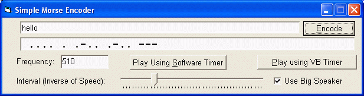



## Simple Morse Encoder v2

### Description

---SIMPLE MORSE ENCODER v 2.0---

!!!NEW VERSION!!!

Simple is Beautiful! The Simple Morse Encoder is back and this time, is in no way simple!

Simple Morse Encoder not only translates from English to Morse, But also plays the sound on either the somputer's internal speaker or through the soundcard!

Type in any message and hit enter... if you know or want to know Morse Code, what you'll hear will be like music to your ears!!!

NOTE: This app uses DirectX 7 to generate sound right through those BIIIG speakers! But for that you need DX7 to be installed on your system.

Hope you like it.

Regards,

Harshad Sharma

(harshad.sharma@bigfoot.com)
 
### More Info
 

             |
---                |---
**Submitted On**   |2002-08-27 23:27:54
**By**             |[Harshad Sharma \(aka Datamatrix\)](https://github.com/Planet-Source-Code/PSCIndex/blob/master/ByAuthor/harshad-sharma-aka-datamatrix.md)
**Level**          |Intermediate
**User Rating**    |4.5 (18 globes from 4 users)
**Compatibility**  |VB 6\.0
**Category**       |[Sound/MP3](https://github.com/Planet-Source-Code/PSCIndex/blob/master/ByCategory/sound-mp3__1-45.md)
**World**          |[Visual Basic](https://github.com/Planet-Source-Code/PSCIndex/blob/master/ByWorld/visual-basic.md)
**Archive File**   |[Simple\_Mor14964511122002\.zip](https://github.com/Planet-Source-Code/harshad-sharma-aka-datamatrix-simple-morse-encoder-v2__1-40670/archive/master.zip)

